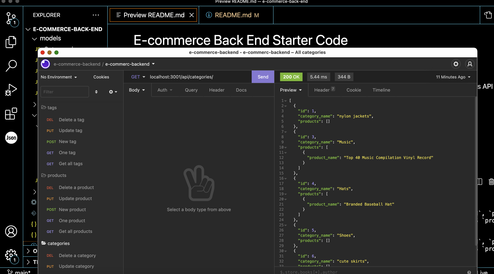

# E-commerce Back End

## Purpose

The purpose of this project was to create the back end for an e-commerce site by configuring a working Express.js API to use Sequelize to interact with a MySQL database. The user can create, read, update and delete data with this application.

## Installation and Usage

1. Install node.js
2. Clone or download the source code from GitHub to your local machine:

```shell
git@github.com:jojochun/e-commerce-back-end.git
```

3. Navigate to the root of the downloaded code:

```shell
cd e-commerce-back-end
```

4. To install required dependencies, open terminal and on command line enter:

```shell
npm init -y (set "main": "server.js", "start": "node server.js")
npm install express sequelize mysql2
npm install dotenv
```

5. Create the .env file and open the file:

```shell
touch .env
code .env
```

6. Add the following to the .env file:

```shell
DB_NAME='ecommerce_db'
DB_USER=''
DB_PW=''
```

7. Navigate to the MySQL shell and enter:

```shell
mysql -u root -p
```

8. Enter MySQL password

9. Create the database and then exit MySQL by entering:

```shell
source db/schema.sql
exit
```

9. To test your routes in Insomnia, seed the database and start the server:

```shell
npm run seed
npm start
```

## Screenshot



## Video Walkthrough

[Video walthrough](https://watch.screencastify.com/v/MJgzEcE3wCGylWK2oQZy)
[Testing API routes with Insomnia](https://watch.screencastify.com/v/XPSFax7Va8NAQCRvl2Gg)

## Built With

HTML

CSS

Javascript

## Technologies

Node.js

npm

mysql2

## License

[](https://opensource.org/licenses/MIT)

## Contribution

Made with ❤️ by Joanne Chun
